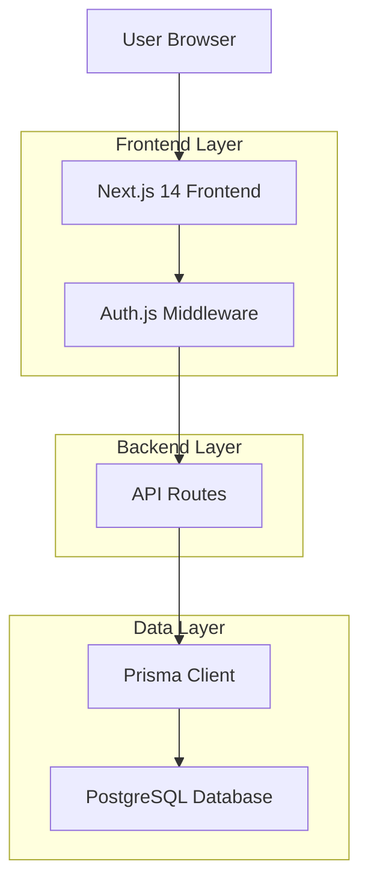
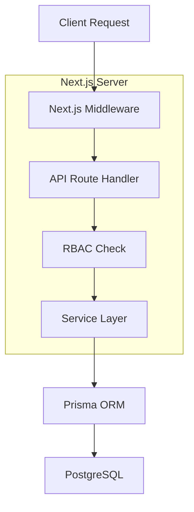
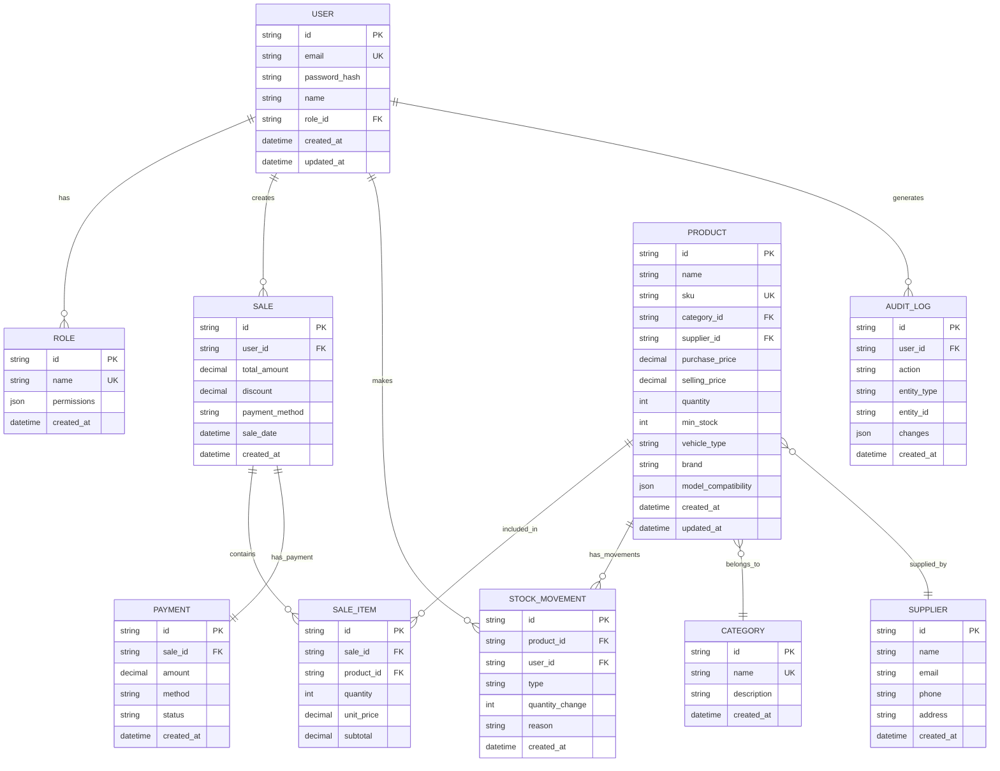

## 1. Architecture design



## 2. Technology Description

- Frontend: Next.js 14 + TypeScript + Tailwind CSS + shadcn/ui
- Initialization Tool: create-next-app
- Backend: Next.js API Routes + Auth.js
- Database: PostgreSQL + Prisma ORM
- Authentication: Auth.js (NextAuth.js)
- UI Components: shadcn/ui + lucide-react
- Form Handling: React Hook Form + Zod
- State Management: TanStack Query
- Styling: Tailwind CSS

## 3. Route definitions

| Route | Purpose |
|-------|---------|
| / | Dashboard principal avec métriques |
| /auth/login | Page de connexion |
| /stock | Gestion des produits et stock |
| /stock/products | Liste des produits |
| /stock/products/new | Ajouter nouveau produit |
| /stock/products/[id] | Modifier produit |
| /stock/suppliers | Gestion fournisseurs |
| /caisse | Interface de vente (POS) |
| /caisse/new | Nouvelle vente |
| /ventes | Historique des ventes |
| /ventes/[id] | Détails vente |
| /utilisateurs | Gestion des utilisateurs |
| /rapports | Rapports financiers |
| /api/auth/* | Endpoints Auth.js |
| /api/products/* | CRUD produits |
| /api/sales/* | Gestion ventes |
| /api/stock/* | Mouvements stock |

## 4. API definitions

### 4.1 Authentication API

```
POST /api/auth/signin
```

Request:
| Param Name | Param Type | isRequired | Description |
|------------|------------|------------|-------------|
| email | string | true | Email utilisateur |
| password | string | true | Mot de passe |

Response: Session JWT avec rôle utilisateur

### 4.2 Products API

```
GET /api/products
```

Response:
```json
{
  "products": [
    {
      "id": "uuid",
      "name": "Amortisseur AR",
      "sku": "AMT-001",
      "category": "Suspension",
      "purchasePrice": 45.00,
      "sellingPrice": 89.00,
      "quantity": 15,
      "minStock": 5
    }
  ]
}
```

```
POST /api/products
```

Request:
| Param Name | Param Type | isRequired | Description |
|------------|------------|------------|-------------|
| name | string | true | Nom produit |
| sku | string | true | Code SKU unique |
| categoryId | string | true | ID catégorie |
| purchasePrice | number | true | Prix d'achat |
| sellingPrice | number | true | Prix de vente |
| quantity | number | true | Quantité initiale |
| minStock | number | true | Stock minimum |

### 4.3 Sales API

```
POST /api/sales
```

Request:
```json
{
  "items": [
    {
      "productId": "uuid",
      "quantity": 2,
      "unitPrice": 89.00
    }
  ],
  "paymentMethod": "cash",
  "discount": 0,
  "total": 178.00
}
```

## 5. Server architecture diagram



## 6. Data model

### 6.1 Data model definition



### 6.2 Data Definition Language

**User Table (users)**
```sql
CREATE TABLE users (
    id UUID PRIMARY KEY DEFAULT gen_random_uuid(),
    email VARCHAR(255) UNIQUE NOT NULL,
    password_hash VARCHAR(255) NOT NULL,
    name VARCHAR(100) NOT NULL,
    role_id UUID NOT NULL,
    created_at TIMESTAMP WITH TIME ZONE DEFAULT NOW(),
    updated_at TIMESTAMP WITH TIME ZONE DEFAULT NOW(),
    FOREIGN KEY (role_id) REFERENCES roles(id)
);

CREATE INDEX idx_users_email ON users(email);
CREATE INDEX idx_users_role ON users(role_id);
```

**Role Table (roles)**
```sql
CREATE TABLE roles (
    id UUID PRIMARY KEY DEFAULT gen_random_uuid(),
    name VARCHAR(50) UNIQUE NOT NULL,
    permissions JSONB NOT NULL DEFAULT '[]',
    created_at TIMESTAMP WITH TIME ZONE DEFAULT NOW()
);

INSERT INTO roles (name, permissions) VALUES
('SUPERADMIN', '["*"]'),
('CAISSE', '["read:products", "create:sales", "read:sales"]'),
('STOCK', '["read:products", "create:products", "update:products", "create:stock_movements"]'),
('COMPTABLE', '["read:sales", "read:reports", "export:data"]');
```

**Product Table (products)**
```sql
CREATE TABLE products (
    id UUID PRIMARY KEY DEFAULT gen_random_uuid(),
    name VARCHAR(255) NOT NULL,
    sku VARCHAR(100) UNIQUE NOT NULL,
    category_id UUID NOT NULL,
    supplier_id UUID,
    purchase_price DECIMAL(10,2) NOT NULL,
    selling_price DECIMAL(10,2) NOT NULL,
    quantity INTEGER NOT NULL DEFAULT 0,
    min_stock INTEGER NOT NULL DEFAULT 5,
    vehicle_type VARCHAR(50) CHECK (vehicle_type IN ('moto', 'auto', 'both')),
    brand VARCHAR(100),
    model_compatibility JSONB DEFAULT '[]',
    created_at TIMESTAMP WITH TIME ZONE DEFAULT NOW(),
    updated_at TIMESTAMP WITH TIME ZONE DEFAULT NOW(),
    FOREIGN KEY (category_id) REFERENCES categories(id),
    FOREIGN KEY (supplier_id) REFERENCES suppliers(id)
);

CREATE INDEX idx_products_sku ON products(sku);
CREATE INDEX idx_products_category ON products(category_id);
CREATE INDEX idx_products_quantity ON products(quantity);
```

**RBAC Permissions Matrix**

| Role | Products | Sales | Stock | Users | Reports |
|------|----------|-------|-------|-------|---------|
| SUPERADMIN | Full access | Full access | Full access | Full access | Full access |
| CAISSE | Read only | Create/Read | None | None | None |
| STOCK | Full access | None | Create/Update | None | None |
| COMPTABLE | Read only | Read only | None | None | Read/Export |

## 7. Security Implementation

- **Authentication**: Auth.js avec JWT tokens
- **Authorization**: Middleware Next.js avec vérification RBAC
- **Validation**: Zod schemas pour toutes les entrées
- **Audit**: Enregistrement automatique des actions sensibles
- **Rate Limiting**: Implémentation Redis pour limiter les requêtes
- **CORS**: Configuration stricte pour domaines autorisés
- **HTTPS**: Obligatoire en production

## 8. Performance Optimization

- **Caching**: Next.js ISR pour pages statiques
- **Images**: Next.js Image component avec optimisation automatique
- **Queries**: TanStack Query avec cache et invalidation
- **Database**: Index optimisés sur colonnes fréquemment consultées
- **Code Splitting**: Chargement dynamique des composants lourds
- **Bundle Size**: Analyse et optimisation des dépendances