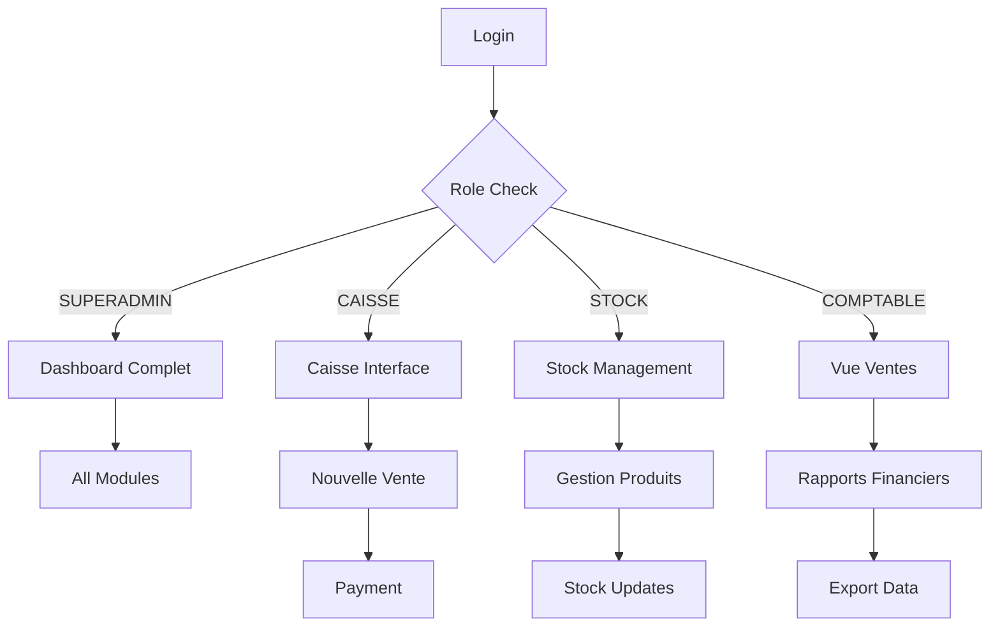

## 1. Product Overview

Application web de gestion complète pour magasin de pièces détachées motos et voitures. Digitalise la gestion papier actuelle du stock et simplifie les opérations de vente pour les employés.

Problème résolu : Fin des fiches papier, gestion centralisée du stock, suivi des ventes et bénéfices en temps réel. Cible les petits et moyens magasins de pièces mécaniques.

## 2. Core Features

### 2.1 User Roles

| Role | Registration Method | Core Permissions |
|------|---------------------|------------------|
| SUPERADMIN | Création manuelle | Accès total, gestion utilisateurs, paramètres système |
| CAISSE | Invitation admin | Créer ventes, voir produits, pas accès bénéfices |
| STOCK | Invitation admin | Gérer produits, stock, fournisseurs |
| COMPTABLE | Invitation admin | Voir ventes et bénéfices, exporter données |

### 2.2 Feature Module

Notre application de gestion mécanique comprend les pages suivantes :

1. **Dashboard** : Vue d'ensemble des ventes, bénéfices, alertes stock
2. **Stock** : Gestion complète des produits, fournisseurs, mouvements
3. **Caisse** : Interface de vente rapide avec calcul automatique
4. **Utilisateurs** : Administration des rôles et permissions
5. **Historique** : Vue détaillée des ventes et mouvements

### 2.3 Page Details

| Page Name | Module Name | Feature description |
|-----------|-------------|---------------------|
| Dashboard | Métriques principales | Afficher ventes du jour, bénéfice total, produits en rupture avec graphiques interactifs |
| Dashboard | Graphiques | Diagrammes en barres pour ventes mensuelles, camembert pour catégories populaires |
| Stock | Liste produits | Tableau filtrable avec recherche instantanée, codes SKU, quantités, prix |
| Stock | Ajout produit | Formulaire avec validation pour nom, catégorie, prix achat/vente, quantité minimale |
| Stock | Fournisseurs | Gestion contacts fournisseurs, historique achats par fournisseur |
| Caisse | Nouvelle vente | Interface rapide : recherche produit, ajout au panier, calcul automatique total |
| Caisse | Paiement | Support multi-paiements (espèce, carte), impression reçu, gestion remise |
| Utilisateurs | Gestion rôles | Interface drag-and-drop pour assigner rôles, audit trail des modifications |
| Historique | Ventes | Filtres par date, utilisateur, montant avec export Excel/PDF |

## 3. Core Process

### Flux utilisateur standard :

1. **Connexion** → Redirection vers Dashboard selon rôle
2. **Vente** → Accès Caisse → Recherche produit → Validation → Paiement → Impression reçu
3. **Gestion stock** → Accès Stock → CRUD produits → Mise à jour quantités → Alertes automatiques
4. **Administration** → Gestion utilisateurs → Attribution rôles → Audit des actions

## 4. User Interface Design

### 4.1 Design Style

- **Couleurs principales** : Bleu mécanique #1E3A8A, Rouge industriel #DC2626
- **Couleurs secondaires** : Gris #6B7280, Blanc #FFFFFF, Noir #111827
- **Style boutons** : Carrés avec coins légèrement arrondis (rounded-lg), ombres subtiles
- **Typographie** : Inter ou Roboto, tailles 14-16px pour texte, 18-20px pour titres
- **Layout** : Sidebar navigation fixe, contenu principal scrollable, cards solides
- **Icônes** : Lucide React avec thème mécanique (clé anglaise, roue dentée, piston)

### 4.2 Page Design Overview

| Page Name | Module Name | UI Elements |
|-----------|-------------|-------------|
| Dashboard | Métriques | Cards en grille 2x2 avec icônes mécaniques, chiffres clés en gras, tendances flèches |
| Dashboard | Graphiques | Recharts avec palette bleu/rouge, tooltips au survol, légende claire |
| Stock | Liste produits | Table avec bordures fines, colonnes triables, badge quantité (vert/rouge selon stock) |
| Caisse | Vente | Interface type POS : produits à gauche, panneau droit avec total, boutons larges |
| Utilisateurs | Rôles | Table utilisateurs avec badges rôles colorés, boutons action compacts |

### 4.3 Responsiveness

Desktop-first design optimisé pour écrans 1280px+. Interface adaptable tablette (768px+) avec sidebar collapsible. Mobile support basique pour consultation rapide.

### 4.4 3D Scene Guidance

Non applicable - Application métier 2D avec focus sur fonctionnalité et performance.